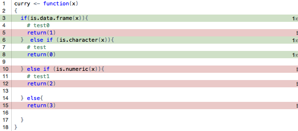

<!-- README.md is generated from README.Rmd. Please edit that file -->
``` r
library(covr)
package_coverage()
#> test Coverage: 25.00%
#> R/addition.R: 0.00%
#> R/doublefun.R: 66.67%

file.rename("R/addition.R", "R/addition.R.bak")
#> [1] TRUE
package_coverage()
#> test Coverage: 66.67%
#> R/doublefun.R: 66.67%

file.rename("R/addition.R.bak", "R/addition.R")
#> [1] TRUE
```

``` r
library(knitr)
library(webshot)
cov <- code_coverage(
'curry2 <- function(x)
{
  if(is.data.frame(x))
    return(1)
  else
    # test
    return(0)
}',
'curry2("a")')

webshot(report(cov, browse = FALSE), selector = c("#files"), eval = "casper.then(function() { this.click('td a')});")
```


``` r
percent_coverage(cov)
#> [1] 66.66667
as.data.frame(cov)
#>                                                                            filename
#> 1 /var/folders/dt/r5s12t392tb5sk181j3gs4zw0000gn/T//RtmpyXdgHV/source.R899c17098495
#> 2 /var/folders/dt/r5s12t392tb5sk181j3gs4zw0000gn/T//RtmpyXdgHV/source.R899c17098495
#> 3 /var/folders/dt/r5s12t392tb5sk181j3gs4zw0000gn/T//RtmpyXdgHV/source.R899c17098495
#>   functions first_line first_byte last_line last_byte first_column
#> 1    curry2          3          6         3        21            6
#> 2    curry2          4          5         4        13            5
#> 3    curry2          7          5         7        13            5
#>   last_column first_parsed last_parsed value
#> 1          21            3           3     1
#> 2          13            4           4     0
#> 3          13            7           7     1
```

``` r
cov <- code_coverage(
'curry <- function(x)
{
  if(is.data.frame(x)){
    # test0
    return(1)
  }  else if (is.character(x)){
    # test
    return(0)

  } else if (is.numeric(x)){
    # test1
    return(2)

  } else{
    return(3)

  }
}',
'curry("a")')

webshot(report(cov, browse = FALSE), selector = c("#files"), eval = "casper.then(function() { this.click('td a')});")
```



``` r
percent_coverage(cov)
#> [1] 42.85714
as.data.frame(cov)
#>                                                                            filename
#> 1 /var/folders/dt/r5s12t392tb5sk181j3gs4zw0000gn/T//RtmpyXdgHV/source.R899c4702e652
#> 2 /var/folders/dt/r5s12t392tb5sk181j3gs4zw0000gn/T//RtmpyXdgHV/source.R899c4702e652
#> 3 /var/folders/dt/r5s12t392tb5sk181j3gs4zw0000gn/T//RtmpyXdgHV/source.R899c4702e652
#> 4 /var/folders/dt/r5s12t392tb5sk181j3gs4zw0000gn/T//RtmpyXdgHV/source.R899c4702e652
#> 5 /var/folders/dt/r5s12t392tb5sk181j3gs4zw0000gn/T//RtmpyXdgHV/source.R899c4702e652
#> 6 /var/folders/dt/r5s12t392tb5sk181j3gs4zw0000gn/T//RtmpyXdgHV/source.R899c4702e652
#> 7 /var/folders/dt/r5s12t392tb5sk181j3gs4zw0000gn/T//RtmpyXdgHV/source.R899c4702e652
#>   functions first_line first_byte last_line last_byte first_column
#> 1     curry          3          6         3        21            6
#> 2     curry          5          5         5        13            5
#> 3     curry          6         15         6        29           15
#> 4     curry          8          5         8        13            5
#> 5     curry         10         14        10        26           14
#> 6     curry         12          5        12        13            5
#> 7     curry         15          5        15        13            5
#>   last_column first_parsed last_parsed value
#> 1          21            3           3     1
#> 2          13            5           5     0
#> 3          29            6           6     1
#> 4          13            8           8     1
#> 5          26           10          10     0
#> 6          13           12          12     0
#> 7          13           15          15     0
```
